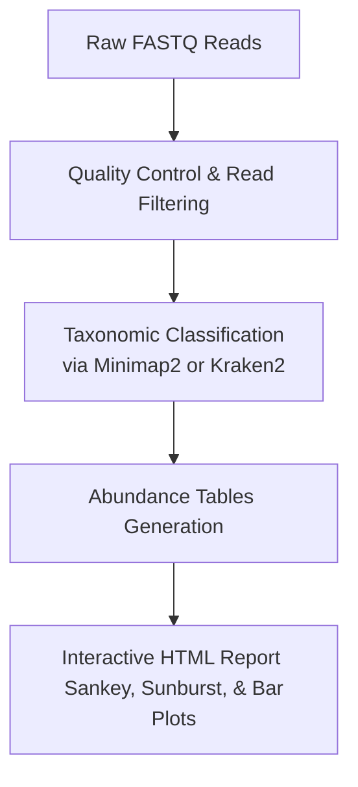

# 16S rRNA Metabarcoding Analysis Tutorial with Nextflow & EPI2ME (wf-16s)

This repository provides a step-by-step practical guide and helper scripts to learn and run **16S rRNA amplicon sequencing analysis** using Oxford Nanopore Technologies' (ONT) Nextflow pipeline, **EPI2ME Labs (`wf-16s`)**.

---

## 📌 Introduction: Do We Need Assembly First?

A common question when starting with 16S rRNA sequencing is: **"Should we assemble the reads first?"** 

The short answer is **no, assembly is not required (and generally not recommended)** for standard 16S taxonomic profiling. 

### Why No Assembly?
1. **Targeted Amplicon Sequencing:** Unlike Whole Genome Sequencing (WGS), 16S rRNA analysis targets only a specific gene region (typically ~1.5 kb for full-length 16S). Assembling these reads would lead to chimeric structures and loss of unique species-level variants because different bacterial species have very similar 16S gene sequences.
2. **Direct Mapping/Classification:** Instead of assembly, the raw FASTQ reads are directly aligned or classified against a curated database of reference sequences (such as SILVA, GreenGenes, or NCBI 16S).
3. **Long-Read Advantages:** Oxford Nanopore technology sequences the entire ~1.5 kb 16S gene in a single read. This means one read equals one full gene, eliminating the need to stitch short reads together and allowing species-level identification directly from the raw reads.

---

## 🏗️ Workflow Architecture

The `wf-16s` pipeline automates the entire downstream analysis after sequencing. Below is the simplified workflow:



By default, the workflow uses:
- **Minimap2:** To align reads to the reference database (default is SILVA).
- **Kraken2 (Optional):** A k-mer-based approach for faster taxonomic classification.

---

## 🛠️ System Requirements & Prerequisites

To run this pipeline, your computer should meet the following recommended specifications:
* **Operating System:** Linux, macOS, or Windows (via WSL2).
* **CPU:** Minimum 6 cores (12 cores recommended).
* **RAM:** Minimum 16 GB (32 GB recommended).

### Software Dependencies
Ensure you have the following tools installed before starting:

1. **Java 11 or higher** (Required to run Nextflow)
   ```bash
   # Check java version
   java -version
   ```
2. **Nextflow**
   ```bash
   # Install Nextflow
   curl -s https://get.nextflow.io | bash
   chmod +x nextflow
   sudo mv nextflow /usr/local/bin/
   ```
3. **Docker** (Recommended) or **Singularity** (Handles software containerization automatically)
   * Make sure your user is added to the `docker` group so you can run it without `sudo`:
     ```bash
     sudo usermod -aG docker $USER
     ```

---

## 🚀 Quick Start Guide

### Step 1: Clone the Repository
```bash
git clone git@github.com:engkinandatama/wf-nanopore-16s-nextflow.git
cd wf-nanopore-16s-nextflow
```

### Step 2: Download the Demo Dataset
We have provided a helper script that automatically downloads the official ONT `wf-16s` test dataset:
```bash
./download_data.sh
```
This script downloads a compressed tarball containing test FASTQ files and extracts them into the `data/` directory.

### Step 3: Run the Analysis
Execute the workflow by running the wrapper script:
```bash
./run_pipeline.sh
```

#### What's happening under the hood?
The `run_pipeline.sh` script runs the following Nextflow command:
```bash
nextflow run epi2me-labs/wf-16s \
  --fastq data/test_data \
  --out_dir results \
  --minimap2_by_reference \
  -profile standard
```
* **`--fastq`**: Path to the folder containing your raw FASTQ files.
* **`--out_dir`**: The directory where output results and reports will be saved.
* **`--minimap2_by_reference`**: Uses alignment-based classification against the SILVA reference database.
* **`-profile standard`**: Pulls and runs all necessary software components (minimap2, kraken2, python tools) within a Docker container.

---

## 📊 Output Directory Structure & Interpretation

Once the pipeline finishes successfully, check the `results/` folder:

```
results/
├── wf-16s-report.html        # Interactive HTML report (Open this in your browser!)
├── abundance_table.tsv       # Taxonomic abundance table (TSV format)
├── reads_alignment.bam       # Alignment file containing mapped reads
└── pipeline_info/            # Logs and execution reports
```

### Key Visualizations in `wf-16s-report.html`:
* **Quality Control:** Statistics about read lengths and quality scores.
* **Sankey & Sunburst Diagrams:** Interactive charts showing the distribution of taxa from Domain down to Species level.
* **Bar Plots:** Absolute and relative abundances of the detected microorganisms.

---

## 💡 Advanced Configurations

### Using a Custom Reference Database
By default, the pipeline uses the SILVA database. You can supply your own reference FASTA file and taxonomy mapping file using:
```bash
nextflow run epi2me-labs/wf-16s \
  --fastq data/test_data \
  --out_dir results \
  --database_fasta custom_ref.fasta \
  --database_taxonomy custom_ref_taxonomy.txt \
  -profile standard
```

### Resuming a Interrupted Run
If the pipeline stops due to a resource limit or disconnect, you can resume from the last successful checkpoint by adding the `-resume` flag:
```bash
nextflow run epi2me-labs/wf-16s --fastq data/test_data --out_dir results -profile standard -resume
```

### 🧪 Dry Run & Pipeline Validation (Testing)
Nextflow supports checking your pipeline structure and logic without running the actual heavy computation or processing datasets.

#### 1. Preview Mode (`-preview`)
This flag runs the workflow script and constructs the Directed Acyclic Graph (DAG) of the execution pipeline, but it **skips running any actual processes**. Use this to check syntax and setup logic:
```bash
./run_preview.sh
```
Or directly:
```bash
nextflow run epi2me-labs/wf-16s --fastq data/test_data --out_dir results -profile standard -preview
```

#### 2. Stub Run Mode (`-stub-run`)
This mode executes the pipeline but replaces the actual tool commands (like Minimap2 alignment) with mock/dummy stubs. It is useful for testing file-flow wiring:
```bash
nextflow run epi2me-labs/wf-16s --fastq data/test_data --out_dir results -profile standard -stub-run
```

